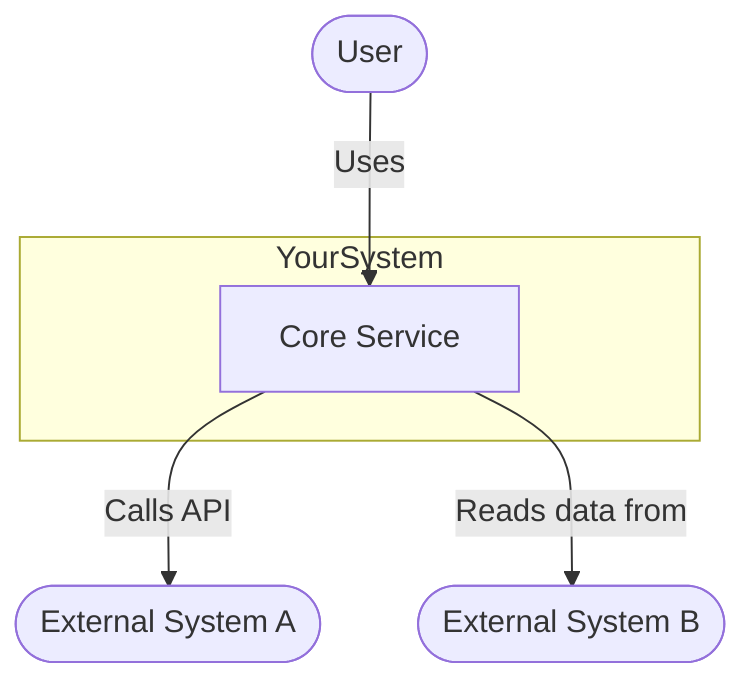
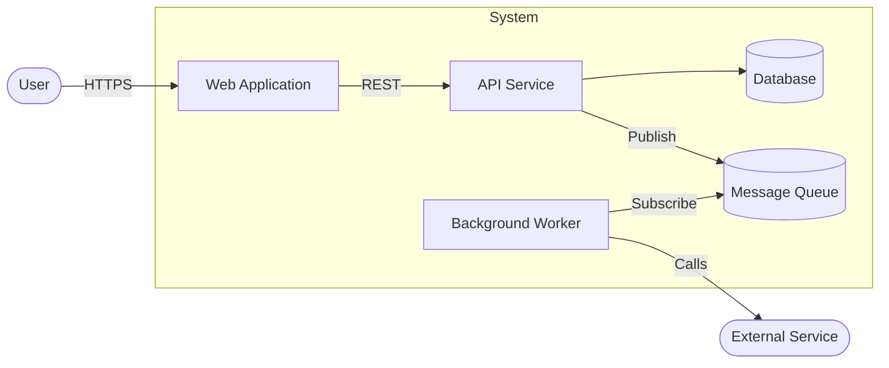
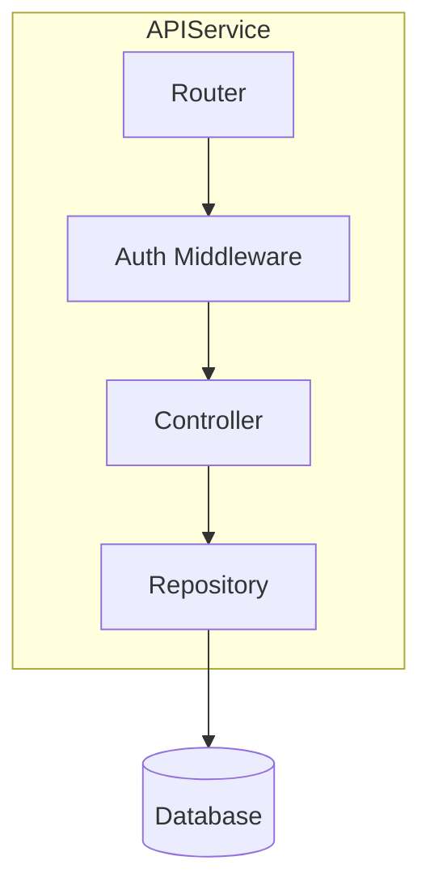

# Architecture Diagram Template

System context and container diagrams using flowchart syntax (C4-inspired, renderer-safe).

## System context diagram (C4 Level 1)

Shows the system in relation to its users and external systems.

## Container diagram (C4 Level 2)

Shows the major containers (apps, services, stores) inside your system.

## Component diagram (C4 Level 3)

Shows the components inside one container.

## Placeholder legend

| Placeholder       | Replace with                             |
|-------------------|------------------------------------------|
| `YourSystem`      | Name of the system being documented      |
| `Core Service`    | Main processing component                |
| `External System` | Real name of the external dependency     |
| `User`            | Actual user type or persona              |
