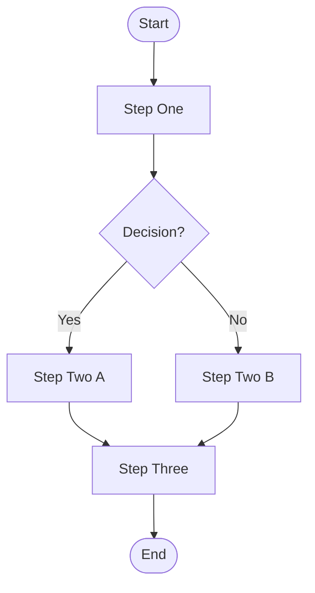
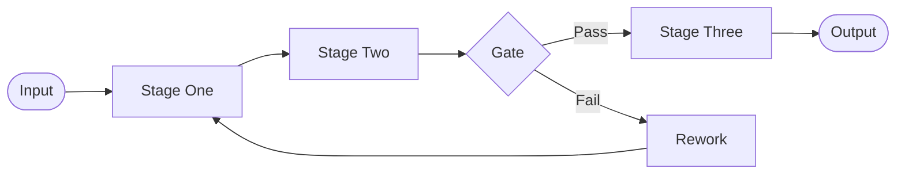
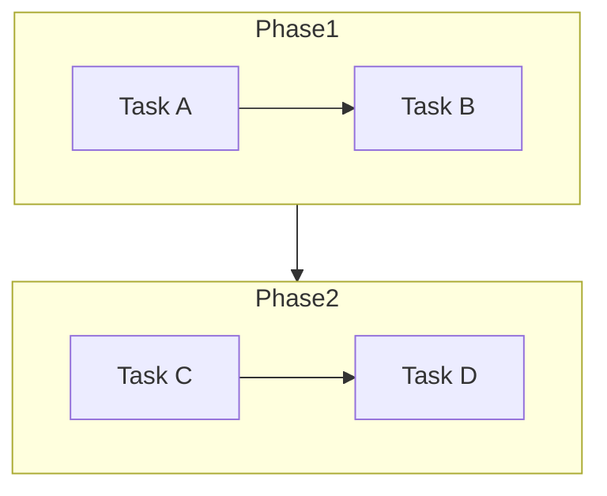

# Flowchart Template

Generic process flowchart. Copy and adapt.

## Top-down process flow

## Left-to-right pipeline flow

## With subgraphs

## Placeholder legend

| Placeholder | Replace with                              |
|-------------|-------------------------------------------|
| `Start`     | Name of the trigger event or entry point  |
| `Step One`  | First action or process step              |
| `Decision?` | The question at the branch point          |
| `Yes` / `No`| Actual condition labels                   |
| `End`       | Outcome or exit point                     |
