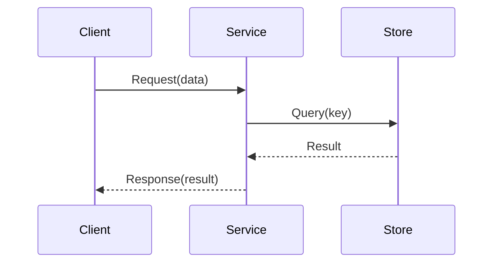
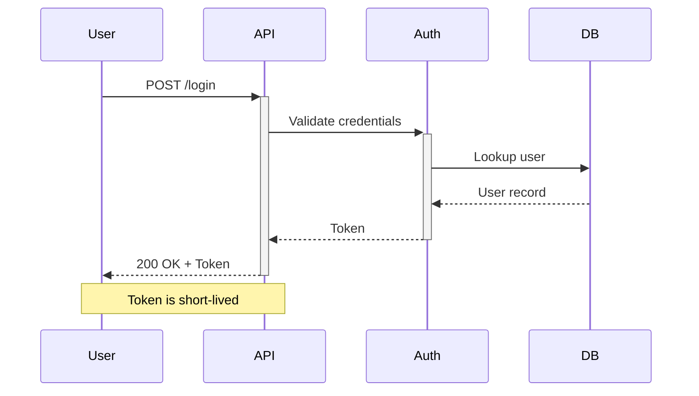
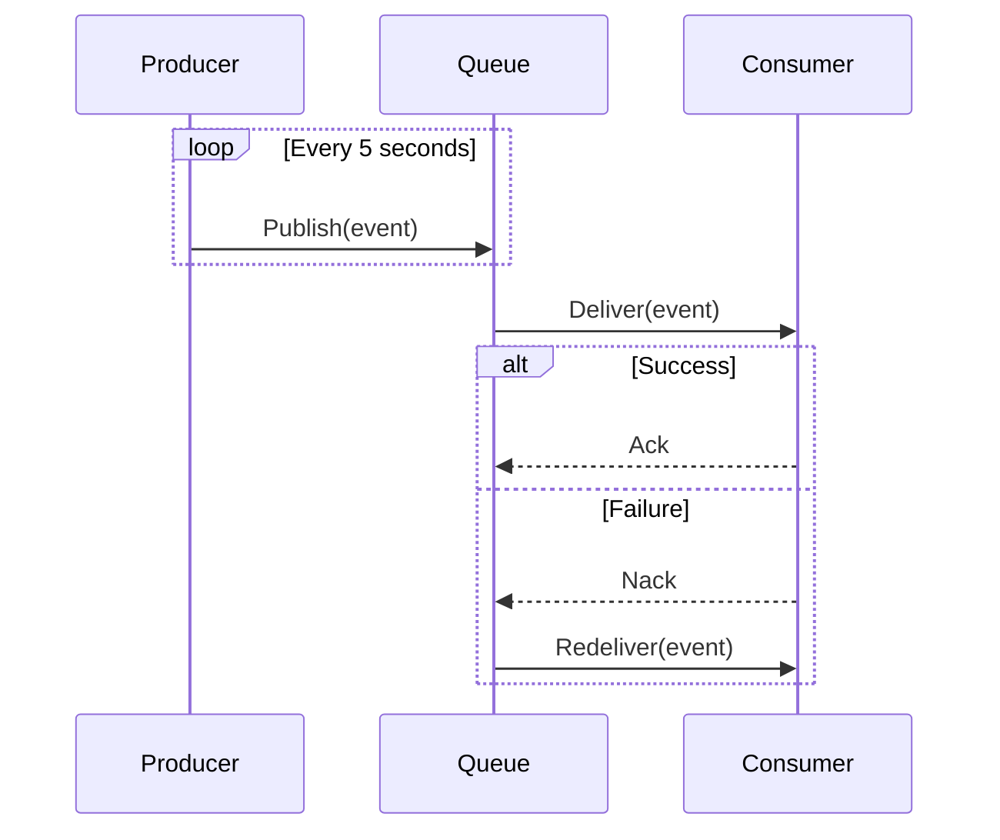

# Sequence Diagram Template

Actor interaction sequence. Copy and adapt.

## Basic request-response

## With activation and notes

## With loop and alt blocks

## Placeholder legend

| Placeholder | Replace with                        |
|-------------|-------------------------------------|
| `Client`    | Initiating actor (user, service)    |
| `Service`   | Processing actor                    |
| `Store`     | Storage or downstream dependency    |
| `Request()` | Actual operation name and payload   |
| `Result`    | Actual return value or status       |
