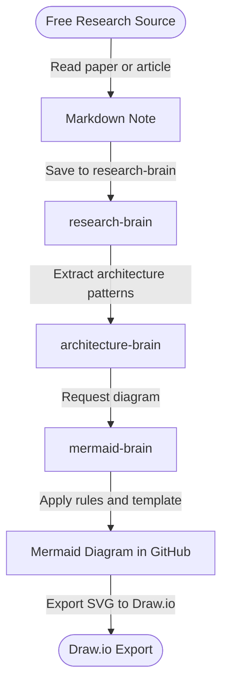

# Sample: Research to Diagram Flow

This example shows the full path a piece of knowledge takes — from a free public research source through the brain system to a Draw.io export.

It demonstrates how the four brains work together on a real end-to-end task.

---

## Diagram

---

## Step-by-step walkthrough

### 1. Free research source → Markdown note

Find a relevant paper on arXiv, Semantic Scholar, or another free source listed in `research-brain/01-sources.md`. Take reading notes in a plain markdown file.

### 2. Markdown note → research-brain

Use the paper summary template from `research-brain/03-papers/README.md` to structure your notes. Save the file as `research-brain/03-papers/<year>-<short-title>.md`.

### 3. research-brain → architecture-brain

Identify any architectural patterns, system designs, or implementation approaches described in the paper. Write an ADR or topic note in `architecture-brain/02-topics/` or `architecture-brain/03-systems/`.

### 4. architecture-brain → mermaid-brain

Decide what diagram would best communicate the system or flow. Choose the right template from `mermaid-brain/02-templates/` and follow the renderer rules in `mermaid-brain/01-renderer-rules.md`.

### 5. mermaid-brain → Mermaid diagram in GitHub

Generate the Mermaid code block and embed it in the relevant `04-diagrams/` file in the target brain. Verify it renders in GitHub Markdown preview.

### 6. Mermaid diagram → Draw.io export

1. Copy the Mermaid source into https://mermaid.live.
2. Export as SVG.
3. Import the SVG into Draw.io.
4. Apply Draw.io styling as needed for presentations.

---

## Notes

- The research and architecture brains store **knowledge**; the mermaid brain stores **how to draw**.
- Diagrams live in the `04-diagrams/` folder of the domain brain they illustrate, not in `mermaid-brain`.
- `mermaid-brain` only holds templates, rules, and examples — not domain-specific diagrams.
